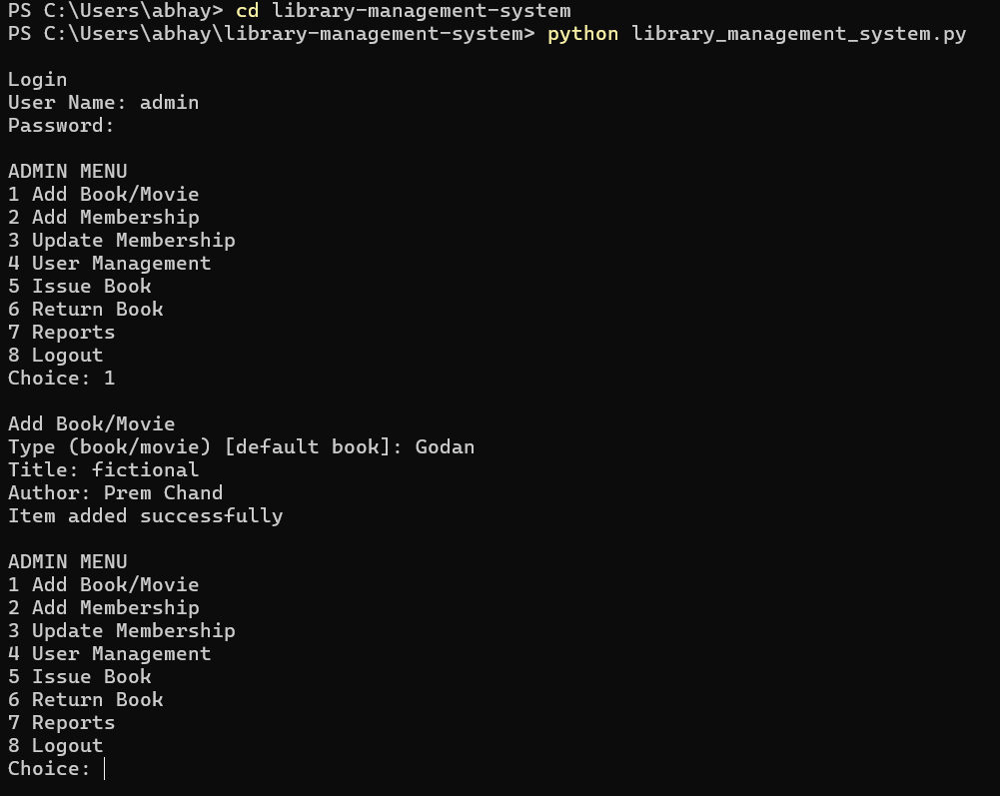

# Library Management System (Python + SQLite)

This project is a console-based Library Management System developed as part of a technical assignment.

The system implements role-based access, membership management, book/movie maintenance, issue & return workflow, fine handling, and reporting — following the specified functional requirements.

---

## Features

Authentication
- Admin and User roles
- Hidden password input

Maintenance Module (Admin Only)
- Add Book or Movie
- Add Membership
- Update Membership (extend or cancel)
- User Management

Transaction Module
- Search Book Availability
- Issue Book (auto issue date + 15-day return rule)
- Return Book
- Fine calculation and payment validation

Reports
- Overdue Books Report

Database
- SQLite database auto-created on first run

---

## How to Run

1. Install Python 3.x
2. Download or clone this repository
3. Open terminal in project folder
4. Run:

   python library_management_system.py

---

## Default Admin Login

Username: admin  
Password: admin

---

## System Rules Implemented

- At least one search field required
- Author auto-filled and non-editable during issue
- Return date cannot exceed 15 days from issue
- Fine must be paid before completing return
- Membership duration options: 6 months, 1 year, 2 years
- Admin has maintenance + transactions + reports
- User has transactions + reports only

---

## Technologies Used

Python  
SQLite  
Console Interface  

---

## Sample Execution
Login
User Name: admin
Password: *****

ADMIN MENU
1 Add Book/Movie
2 Add Membership
3 Update Membership
4 User Management
5 Issue Book
6 Return Book
7 Reports
8 Logout

Add Membership
Member Name: Rahul Sharma
Duration (6m/1y/2y) [default 6m]:
Membership created

Issue Book
Enter title: Python
Issue Date: 2026-02-18
Return Date: 2026-03-05
Book issued successfully

Return Book
Issue ID: 1
Fine: 0
Return completed

---

## Author

Abhay Yadav

## System Execution Screenshot

Console execution showing login, membership creation, and book issue workflow.

